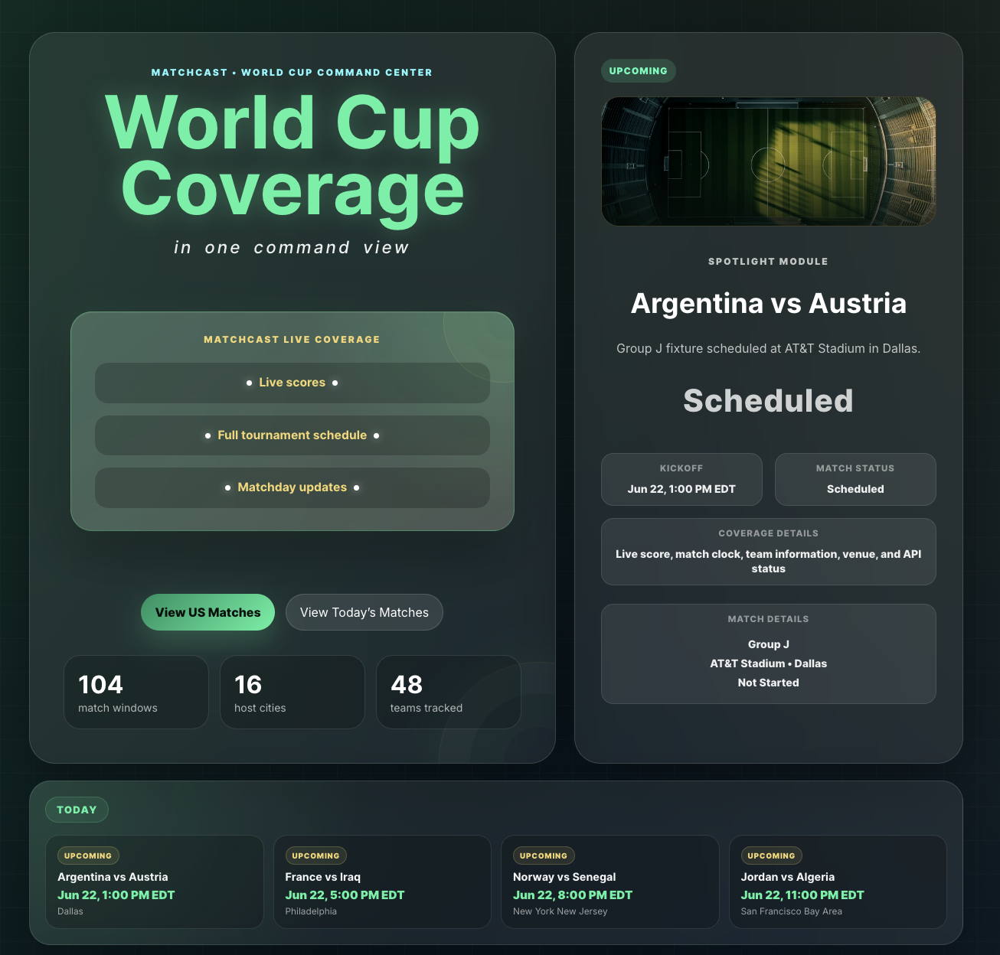
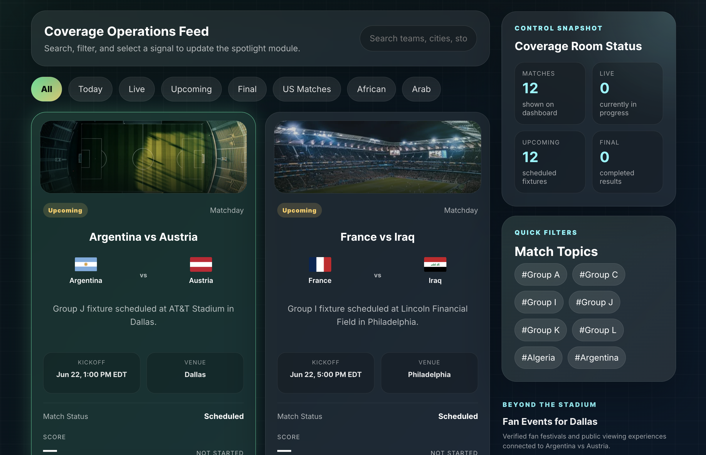
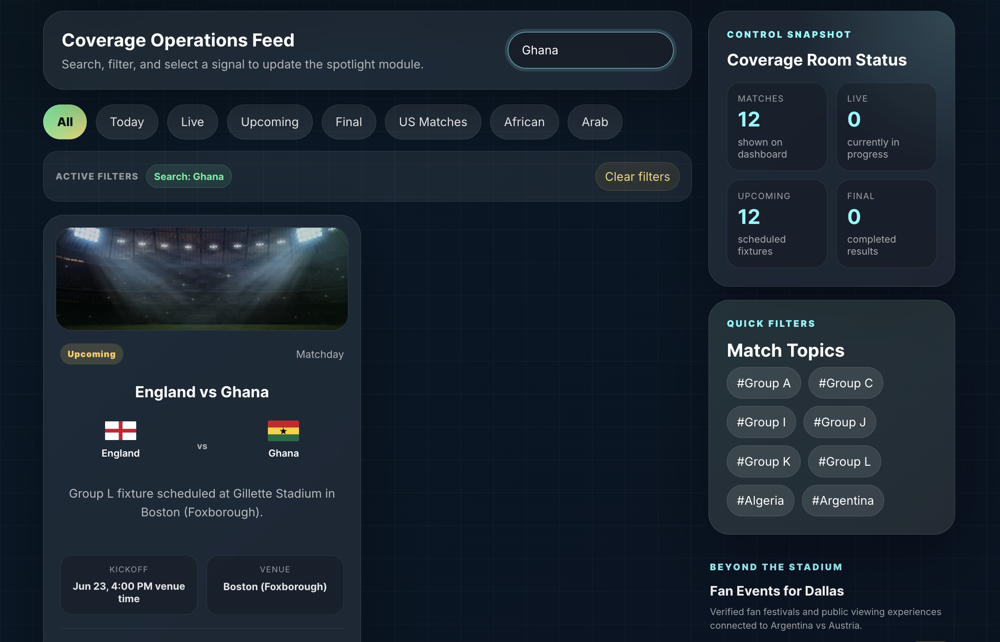
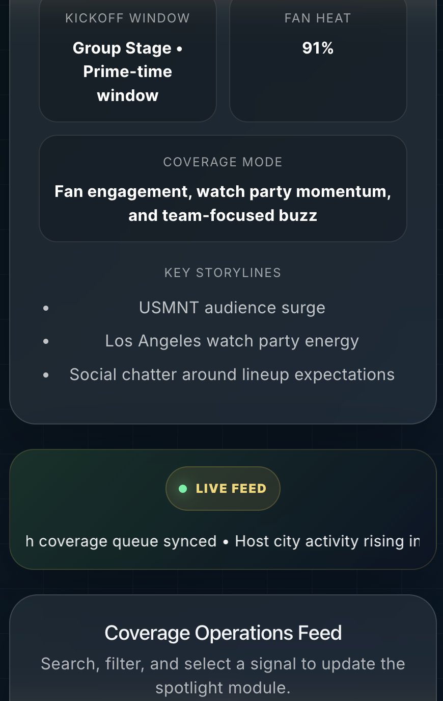

# MatchCast: World Cup Command Center

**Status:** Full-stack v2 deployed.

**Live Demo:** https://matchcast-world-cup-dashboard.vercel.app

**GitHub:** https://github.com/imoon2003/matchcast-world-cup-dashboard

MatchCast is a World Cup coverage dashboard built to model how a live sports media or event-operations team could monitor match windows, tournament signals, host-city activity, fan events, and live score updates from one command view.

The project combines a polished React/Vite frontend with a local Node/Express backend. It uses a World Cup schedule catalog, API-Football score overlays, verified fan-event data, fallback logic, and backend-side response caching to create a more realistic full-stack sports dashboard experience.

*Built and maintained by **Iman Ahmed** as a full-stack software engineering portfolio project.*



## Overview

MatchCast was built as a portfolio project focused on frontend engineering, sports media workflows, and practical full-stack architecture.

Users can browse World Cup coverage cards, search and filter match signals, select a match to update the spotlight panel, view live or scheduled match context, and explore verified fan events connected to host cities. The app is designed to stay usable even when external data is incomplete by falling back to local catalog data and featured verified events.

## Features

* Responsive React dashboard built with Vite
* Node/Express backend for World Cup schedule and fan-event APIs
* API-Football integration for live-score overlays
* Backend-side response caching to reduce third-party API usage
* Local World Cup schedule catalog with stable fallback data
* Verified fan-event discovery layer with city-based filtering
* Fallback logic for fan-event and match data availability
* Search across teams, cities, match status, descriptions, and tags
* Category filtering for matchday, host city, team spotlight, and storyline modules
* Dynamic spotlight panel that updates based on the selected match card
* Live match strip with score and match-clock display
* Coverage summary panel with calculated dashboard metrics
* Loading, empty, and error-state handling
* Keyboard-accessible match cards with visible focus states
* Mobile-responsive layout with stacked sections for smaller screens
* Environment-controlled system status panel for local development notes

## Screenshots

### Dashboard Overview


### Coverage Operations Feed



### Filtered Coverage Signals



### Mobile Responsive View



## Tech Stack

* React
* Vite
* JavaScript
* CSS
* Node.js
* Express
* API-Football
* CSS Grid
* Flexbox
* Vercel

## Project Structure

```text
matchcast-world-cup-dashboard/
├── public/
│   ├── images/
│   └── favicon.svg
├── screenshots/
│   ├── 01-dashboard-overview.png
│   ├── 02-coverage-feed.png
│   ├── 03-filtered-signals.png
│   └── 04-mobile-responsive.png
├── server/
│   └── src/
│       ├── services/
│       │   ├── fanEvents.js
│       │   └── scheduleCatalog.js
│       └── server.js
├── src/
│   ├── api/
│   │   └── matchCastApi.js
│   ├── components/
│   │   ├── ActiveFilters.jsx
│   │   ├── CategoryTabs.jsx
│   │   ├── CoverageSummary.jsx
│   │   ├── DashboardControls.jsx
│   │   ├── EmptyState.jsx
│   │   ├── ErrorState.jsx
│   │   ├── FanEvents.jsx
│   │   ├── Hero.jsx
│   │   ├── LoadingState.jsx
│   │   ├── MatchCard.jsx
│   │   ├── SpotlightCard.jsx
│   │   ├── SystemStatus.jsx
│   │   ├── Ticker.jsx
│   │   └── TrendPanel.jsx
│   ├── App.css
│   ├── App.jsx
│   └── main.jsx
├── index.html
├── package.json
├── vite.config.js
└── README.md
```

## Getting Started

Clone the repository:

```bash
git clone https://github.com/imoon2003/matchcast-world-cup-dashboard.git
cd matchcast-world-cup-dashboard
```

Install frontend dependencies:

```bash
npm install
```

Install backend dependencies:

```bash
cd server
npm install
```

Create a local frontend environment file in the project root:

```env
VITE_API_BASE_URL=http://localhost:5050
VITE_USE_MOCK_FALLBACK=false
VITE_SHOW_SYSTEM_STATUS=true
```

Start the backend server:

```bash
cd server
npm run dev
```

Start the frontend in a separate terminal:

```bash
npm run dev
```

Open the local frontend URL shown in the terminal. It is usually:

```text
http://localhost:5173/
```

Build for production:

```bash
npm run build
```

Preview the production build:

```bash
npm run preview
```

## Data and API Approach

MatchCast uses a hybrid data approach:

* A local World Cup schedule catalog provides stable match data.
* API-Football overlays live score and match-status updates when available.
* Backend-side caching reduces repeated third-party API calls.
* Verified fan-event data connects selected matches to nearby public viewing events.
* Fallback logic keeps the dashboard useful when city-specific event data is unavailable.

This approach keeps the project stable for portfolio review while still demonstrating production-style API handling, caching, fallback logic, and data-driven UI updates.


## Environment Notes

The `SystemStatus` component is available for local development and portfolio review, but it is hidden unless this environment variable is set:

```env
VITE_SHOW_SYSTEM_STATUS=true
```

For public deployment, do not add `VITE_SHOW_SYSTEM_STATUS` in Vercel. This keeps the internal system-status card hidden from regular users.

## Accessibility

MatchCast includes several accessibility-focused improvements:

* keyboard-accessible match cards
* visible focus states
* screen-reader labels for interactive elements
* status handling for loading, empty, and error states
* semantic HTML sections for dashboard content

## Future Improvements

* Deploy the backend API separately for production use
* Add route-based navigation with React Router
* Add dedicated team and host-city detail pages
* Add saved or favorite coverage modules
* Add unit tests for filtering and component behavior
* Expand live-data support for additional tournaments and leagues

## Ownership & Disclaimer

MatchCast is an independent portfolio project built by Iman Ahmed. It is not affiliated with FIFA, NBCUniversal, or any official World Cup organization. All event and match references are used for educational and demonstration purposes.
