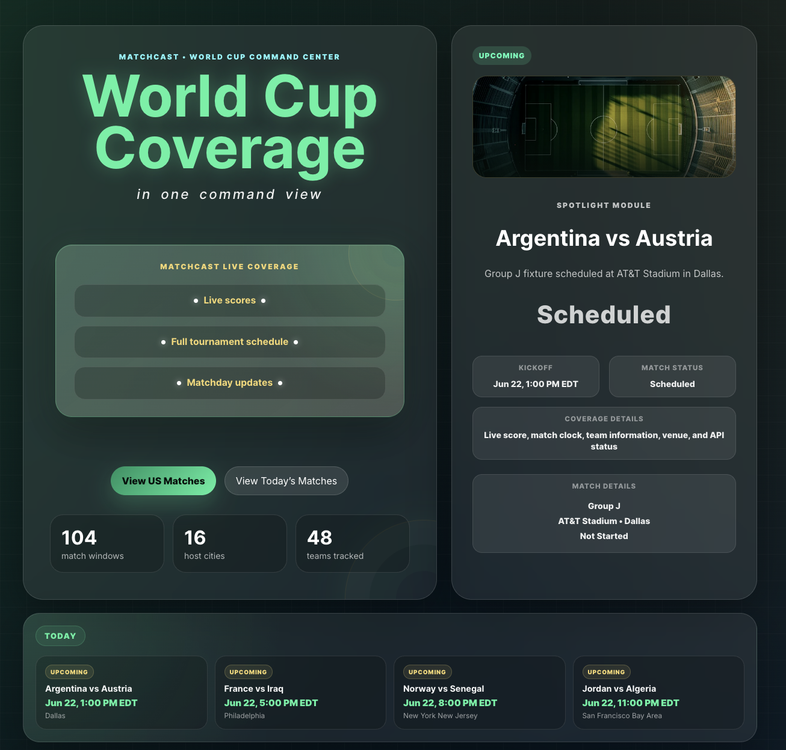
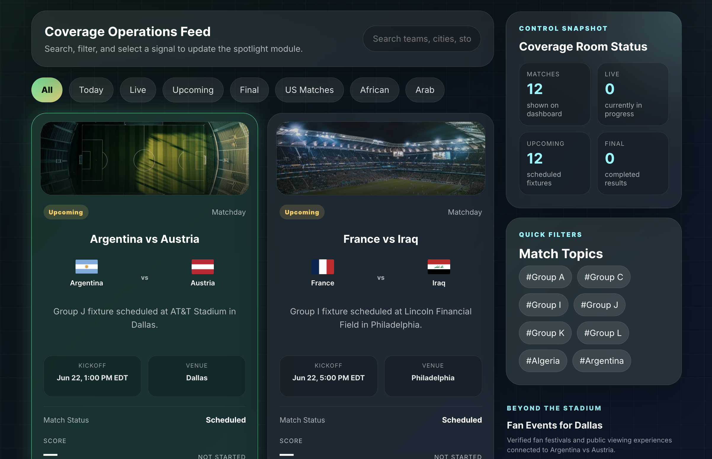
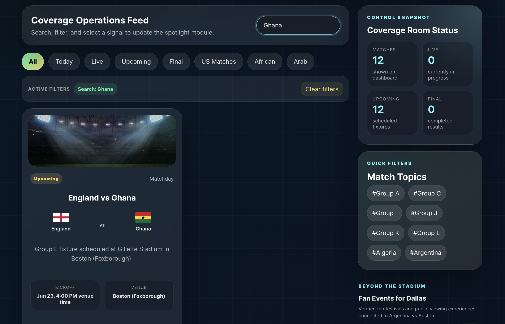
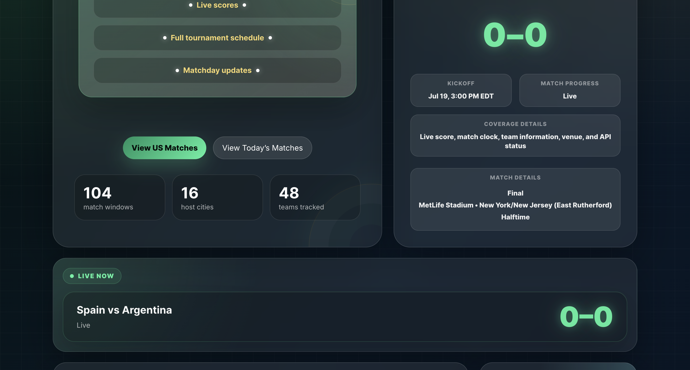
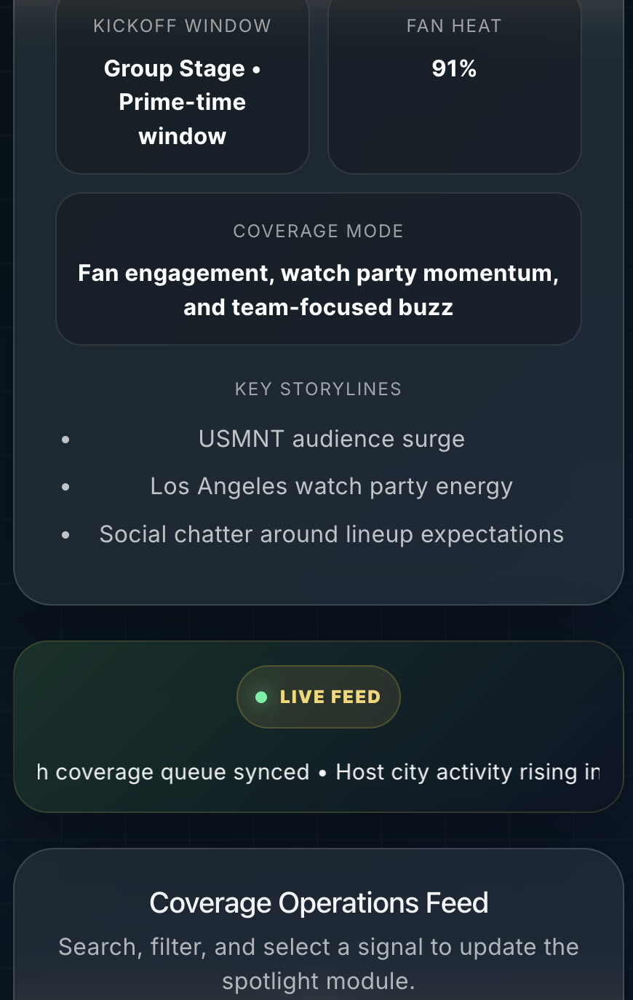

# MatchCast: World Cup Command Center

*Built and maintained by **Iman Ahmed** as a full-stack software engineering portfolio project.*

**Status:** Full-stack v2 deployed with live match data integration and a tournament-complete results experience.

**Live Demo:** https://matchcast-world-cup-dashboard.vercel.app

**GitHub:** https://github.com/imoon2003/matchcast-world-cup-dashboard

MatchCast is a World Cup coverage dashboard built to model how a live sports media or event-operations team could monitor match windows, tournament signals, host-city activity, fan events, and live score updates from one command view.

The project combines a polished React/Vite frontend with a deployed Node/Express backend. It uses football-data.org match data, a curated World Cup schedule catalog, verified fan-event data, host-city alias matching, fallback schedule logic, and backend-side response caching to create a more realistic full-stack sports dashboard experience.

When the tournament is complete, MatchCast automatically transitions from active coverage modules to a dedicated podium view. The dashboard identifies the final and third-place matches, determines each placement from the match results, and displays the champion, runner-up, third-place team, and fourth-place team in a responsive results layout.



## Overview

MatchCast was built as a portfolio project focused on frontend engineering, sports media workflows, and practical full-stack architecture.

Users can browse World Cup coverage cards, search and filter match signals, select a match to update the spotlight panel, view live, final, or scheduled match context, and explore verified fan events connected to host cities.

The app is designed to stay usable even when external data is incomplete. Live match data is merged with a local venue catalog so the dashboard can show real teams, scores, statuses, stadiums, and host cities together. For fan events, the app uses verified event data and U.S. host-city alias matching so stadium suburbs such as Inglewood, Miami Gardens, Foxborough, Arlington, Santa Clara, and East Rutherford connect back to the correct host-city fan experience.

## Features

* Responsive React dashboard built with Vite
* Node/Express backend deployed on Render
* football-data.org integration for match teams, scores, kickoff times, and statuses
* Backend-side response caching to reduce third-party API usage
* Local World Cup schedule catalog with stadium and host-city data
* Schedule merge logic that combines live match data with curated venue details
* Verified fan-event discovery layer with city-based filtering
* U.S. host-city alias matching for stadium suburbs and regional host names
* Search across teams, cities, match status, descriptions, and tags
* Category filtering for matchday, host city, team spotlight, and storyline modules
* Dynamic spotlight panel that updates based on the selected match card
* Live match strip with score and match-status display
* Coverage summary panel with calculated dashboard metrics
* Loading, empty, and error-state handling
* Keyboard-accessible match cards with visible focus states
* Mobile-responsive layout with stacked sections for smaller screens
* Environment-controlled system status panel for local development notes
* Tournament-complete podium with champion and placement results
* Automatic final and third-place match detection
*  Dynamic placement calculation using winner data and match scores
*  Responsive team-flag and tournament-results presentation

## Screenshots

### Dashboard Overview


### Coverage Operations Feed



### Filtered Coverage Signals



### Live Match Strip



### Mobile Responsive View



## Tech Stack

* React
* Vite
* JavaScript
* CSS
* Node.js
* Express
* football-data.org
* CSS Grid
* Flexbox
* Vercel
* Render

## Project Structure

```text
matchcast-world-cup-dashboard/
├── public/
│   ├── images/
│   └── favicon.svg
├── screenshots/
│   ├── 01-dashboard-overview.png
│   ├── 02-coverage-feed.png
│   ├── 03-filtered-signals.png
│   ├── 04-mobile-responsive.png
│   └── 05-live-match-strip.png
├── server/
│   └── src/
│       ├── services/
│       │   ├── fanEvents.js
│       │   └── scheduleCatalog.js
│       └── server.js
├── src/
│   ├── api/
│   │   └── matchCastApi.js
│   ├── components/
│   │   ├── ActiveFilters.jsx
│   │   ├── CategoryTabs.jsx
│   │   ├── CoverageSummary.jsx
│   │   ├── DashboardControls.jsx
│   │   ├── EmptyState.jsx
│   │   ├── ErrorState.jsx
│   │   ├── FanEvents.jsx
│   │   ├── Hero.jsx
│   │   ├── LoadingState.jsx
│   │   ├── MatchCard.jsx
│   │   ├── PodiumSection.jsx
│   │   ├── SpotlightCard.jsx
│   │   ├── SystemStatus.jsx
│   │   ├── Ticker.jsx
│   │   └── TrendPanel.jsx
│   ├── App.css
│   ├── App.jsx
│   └── main.jsx
├── index.html
├── package.json
├── vite.config.js
└── README.md
```

## Tech Decisions

### Tournament Results Experience

The tournament-complete view includes:

* Automatic detection of final and third-place matches
* Champion, runner-up, third-place, and fourth-place calculations
* Team flags pulled from match data
* A featured champion card with trophy styling
* Separate placement cards for the remaining finalists
* Responsive desktop and mobile layouts
* Graceful fallback text when complete result data is unavailable

### Live Data Provider

MatchCast uses football-data.org for World Cup match data. The backend pulls match teams, crests, scores, kickoff times, and statuses, then normalizes that response for the frontend.

This allows the dashboard to show real match states such as live, final, and upcoming instead of relying only on static schedule data.

### Schedule Catalog Merge

football-data.org provides match information, but the project also needs accurate stadium and host-city details. To solve that, MatchCast merges live match data with a curated 2026 World Cup schedule catalog.

This gives each card both live match information and operational context, including venue, host city, stage, and fan-event city mapping.

### Backend Caching

MatchCast uses backend-side response caching for World Cup schedule requests to reduce repeated third-party API calls and protect API limits during refreshes. Live match data is cached for a shorter period so scores can stay current, while non-live schedule data is cached longer because it changes less frequently.

This makes the app more reliable in a deployed environment, especially when multiple users are viewing the dashboard or when the frontend refreshes match data in the background.

### Fan Event Filtering

MatchCast includes a verified fan-event layer for U.S. World Cup host cities. When a user selects a match card, the app passes that match’s host city to the backend, and the backend filters fan events using city aliases.

Examples include:

* Miami Gardens → Miami
* Inglewood → Los Angeles
* Foxborough → Boston
* Arlington → Dallas
* Santa Clara → San Francisco Bay Area
* East Rutherford → New York/New Jersey

This keeps the fan-event panel connected to the selected match city without showing unrelated events from every host city.

### Fallback Data Handling

MatchCast combines live API data with a local World Cup schedule catalog. If external API data is unavailable, incomplete, or missing certain match details, the app can still display useful schedule and coverage information from the local dataset.

For fan events, selected host cities are filtered specifically. If no verified local fan event is available for a selected city, the app shows a clear local-not-found message instead of falling back to unrelated fan events from other cities.

### Deployment Architecture

The frontend is deployed on Vercel, while the backend API is deployed separately on Render. This separation keeps the React/Vite client lightweight and allows the Node/Express backend to manage API requests, caching, environment variables, CORS settings, and fallback logic.

The deployed frontend communicates with the Render API through a production environment variable, allowing the same codebase to support both local development and production deployment.

## Getting Started

Clone the repository:

```bash
git clone https://github.com/imoon2003/matchcast-world-cup-dashboard.git
cd matchcast-world-cup-dashboard
```

Install frontend dependencies:

```bash
npm install
```

Install backend dependencies:

```bash
cd server
npm install
```

Create a local frontend environment file in the project root:

```env
VITE_API_BASE_URL=http://localhost:5050
VITE_USE_MOCK_FALLBACK=false
VITE_SHOW_SYSTEM_STATUS=true
```

Create a local backend environment file inside the `server/` folder:

```env
PORT=5050
CLIENT_ORIGIN=http://localhost:5173
FOOTBALL_DATA_KEY=your_football_data_key
FOOTBALL_DATA_BASE_URL=https://api.football-data.org/v4
WORLD_CUP_SEASON=2026
```

Start the backend server:

```bash
cd server
npm run dev
```

Start the frontend in a separate terminal from the project root:

```bash
npm run dev
```

Open the local frontend URL shown in the terminal. It is usually:

```text
http://localhost:5173/
```

Build for production:

```bash
npm run build
```

Preview the production build:

```bash
npm run preview
```

## Live Data + Backend

MatchCast uses a custom Express backend deployed on Render to combine live World Cup match data with a curated host-city schedule catalog.

The backend pulls match teams, scores, kickoff times, and statuses from football-data.org, then merges that data with the app’s internal 2026 World Cup venue catalog so each card can show both live match information and accurate stadium/city details.

Backend API:

* Render: `https://matchcast-api-4pwj.onrender.com`
* Schedule endpoint: `/api/world-cup/schedule?overlay=today`
* Fan events endpoint: `/api/fan-events`

The dashboard currently supports:

* Live, final, and upcoming match status mapping
* Real team names, scores, and crests
* Stadium and host-city mapping
* U.S. host-city fan event filtering
* City aliases such as Miami Gardens → Miami, Inglewood → Los Angeles, Foxborough → Boston, and Arlington → Dallas

## Environment Notes

For local development, the `SystemStatus` component can be shown with:

```env
VITE_SHOW_SYSTEM_STATUS=true
```

For public deployment, do not add `VITE_SHOW_SYSTEM_STATUS` in Vercel. This keeps the internal system-status card hidden from regular users.

Production frontend environment variables:

```env
VITE_API_BASE_URL=https://matchcast-api-4pwj.onrender.com
VITE_USE_MOCK_FALLBACK=false
```

Production backend environment variables:

```env
FOOTBALL_DATA_KEY=your_football_data_key
FOOTBALL_DATA_BASE_URL=https://api.football-data.org/v4
WORLD_CUP_SEASON=2026
CLIENT_ORIGIN=https://matchcast-world-cup-dashboard.vercel.app
```

## Accessibility

MatchCast includes several accessibility-focused improvements:

* Keyboard-accessible match cards
* Visible focus states
* Screen-reader labels for interactive elements
* Status handling for loading, empty, and error states
* Semantic HTML sections for dashboard content

## Future Improvements

* Add route-based navigation with React Router
* Add dedicated team and host-city detail pages
* Add saved or favorite coverage modules
* Add unit tests for filtering, status mapping, and component behavior
* Expand verified fan-event coverage for Canada and Mexico host cities
* Add richer match detail views with timeline, scorers, and match statistics
* Expand live-data support for additional tournaments and leagues

## Ownership & Disclaimer

MatchCast is an independent portfolio project built by Iman Ahmed. It is not affiliated with FIFA, football-data.org, or any official World Cup organization. All event and match references are used for educational and demonstration purposes.
